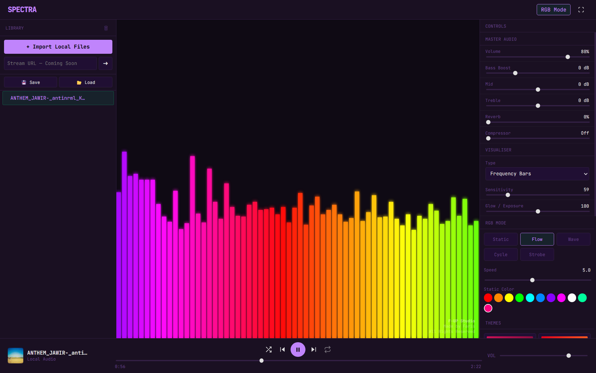
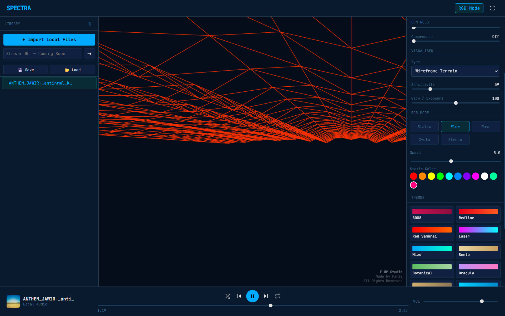

# SPECTRA

A modern browser-based audio visualizer built with HTML, CSS, JavaScript, the Web Audio API, and Three.js.

Spectra combines music playback, audio processing, customizable themes, RGB lighting effects, and both 2D and 3D visualizations into a single application. Audio can be imported directly from local files and visualized in real time with adjustable effects and display modes.

## Preview

### Visual 1

### Visual 2

## Features

### Audio Playback

* Local audio file importing
* Playlist and queue management
* Drag and drop audio support
* Play, pause, next, and previous controls
* Shuffle and repeat modes
* Seek bar with playback tracking
* Master volume control

### Audio Processing

* Bass adjustment
* Midrange adjustment
* Treble adjustment
* Reverb control
* Compressor control
* Real-time frequency analysis

### Visualizers

#### 2D Modes

* Frequency Bars
* Waveform
* Circular Spectrum
* CRT Oscilloscope

#### 3D Modes

* Audio Tunnel
* Wireframe Terrain
* Particle Galaxy
* Orbiting Rings

### RGB Engine

* Static color mode
* Flow mode
* Wave mode
* Cycle mode
* Strobe mode
* Adjustable RGB speed
* Custom color presets

### Themes

Includes multiple keyboard-inspired themes:

* 8008
* Redline
* Red Samurai
* Laser
* Mizu
* Bento
* Botanical
* Dracula
* Oblivion
* Metropolis
* Carbon
* Pulse
* Terminal
* Night Runner
* Yuri
* Frost Witch

### Export Tools

* PNG snapshot export
* Visualizer recording support

## Technologies Used

* HTML5
* CSS3
* JavaScript
* Web Audio API
* Three.js

## Usage

1. Open the application in a modern web browser.
2. Import audio files from your computer.
3. Select a visualizer mode.
4. Adjust audio processing settings.
5. Customize themes and RGB effects.
6. Enjoy real-time audio visualization.

## Project Goals

Spectra was built to explore browser-based audio visualization, real-time signal processing, and interactive visual effects without requiring native software installation.

The project focuses on combining audio playback, customization, and immersive visual feedback in a single web application.

## License

All Rights Reserved.

Created by Faris.
